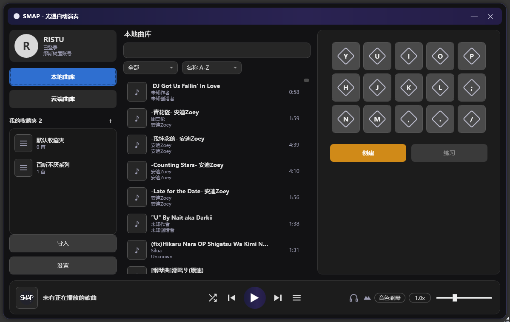
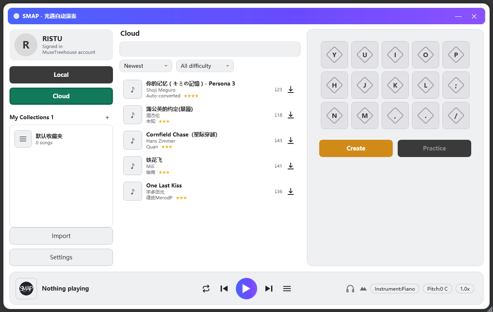
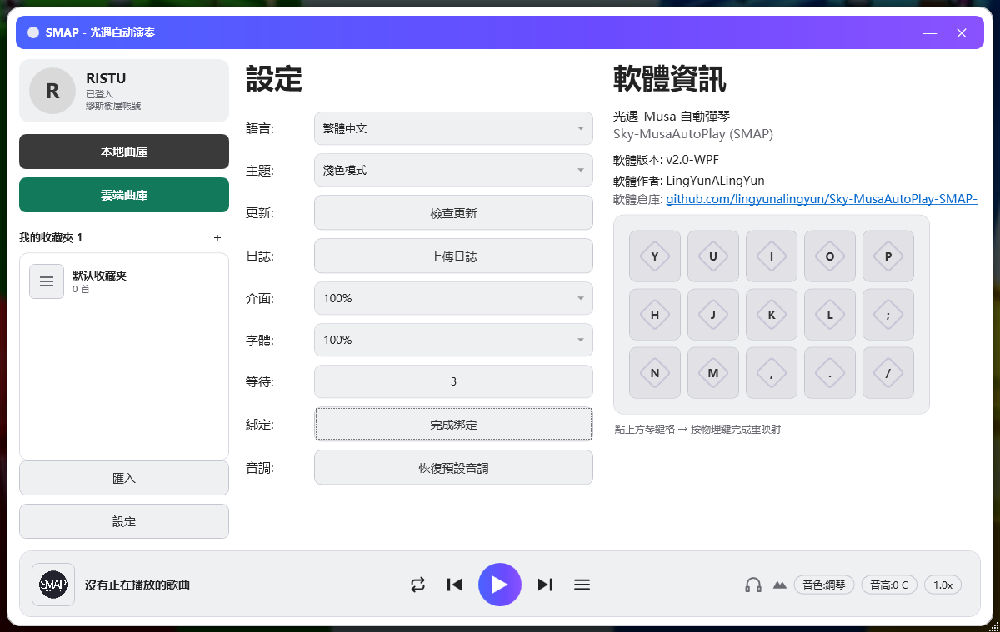
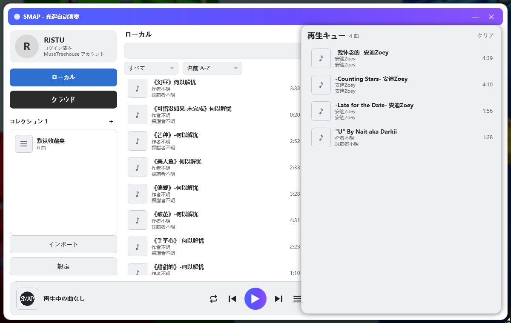

# SMAP · 光遇-Musa 自动演奏

**Sky-MusaAutoPlay** — 《光·遇》(Sky: Children of the Light) 自动弹琴助手 · 音乐软件式 C# WPF 版

[English](README_EN.md) · [下载 Releases](https://github.com/lingyunalingyun/Sky-MusaAutoPlay-SMAP-/releases) · [旧 JavaFX 版](JAVA%20version/)

---

## 简介

SMAP 是一款《光·遇》自动弹琴助手：导入或制作曲谱，即可在游戏里自动演奏乐器。
新版本用 **C# WPF 完全重写**，界面重做成**音乐软件**的样子——左侧账号 + 收藏夹侧边栏、中间带封面的曲库、右侧虚拟琴键、底部通栏播放器，播放列表、云端曲库、设置界面一应俱全。

> 🍬 **v2.2「音韵」**：练习模式新增**读谱墙、打点模式与游戏练习**，置顶窗口并在游戏中全局监听琴键；重做全局播放快捷键；新增曲谱封面上传/展示、网站账号头像和第三主题「落日糖纸」；下拉菜单、收藏按钮等交互加入非线性动画；更新流程升级为应用内自动下载、安装并重启。

> 🎹 v2.1：新增全屏练习（跟弹）模式、示范播放、状态与播放进度记忆。

> 🎵 v2.0：游戏内乐器音色补全到 **37 种**（含 27 个光遇原版音色），每乐器移调、手动弹奏长按持续音、随机变速等演奏增强。

> ⚠️ 本软件需**以管理员身份运行**（模拟全局按键所需，启动会自动请求 UAC）。

## 截图

| 深色 · 本地曲库（简体中文） | 浅色 · 云端曲库（English） |
|:---:|:---:|
|  |  |
| **繁體中文 · 設定 / 軟體資訊** | **日本語 · 再生キュー** |
|  |  |

## 主要功能

### 播放
- **自动弹琴** — 按曲谱时间线模拟全局按键，在光遇里自动演奏（用扫描码 + 按住时长，兼容游戏逐帧轮询）
- **演奏 / 试听开关** — 右下开关：**默认试听**（走扬声器、不误触游戏），点亮切到**演奏**（发送游戏按键）
- **底部播放器** — 封面 / 歌名·作者·创谱者 / 收藏星 / 随机·上一首·播放·下一首·播放列表 / 演奏模式 / 洞穴音效 / 音色 / 音高(移调) / 倍速(含随机变速)
- **进度条** — 贴容器顶边的通栏细线，悬浮变粗 + 白色把手 + 时间胶囊（把手与胶囊实时跟随播放进度）；可拖动跳转，暂停时也能拖
- **播放列表** — 右侧滑出队列；双击曲库加入并播放；三种播放方式（列表循环 / 单曲循环 / 随机）；一曲放完**间隔 2 秒**自动续播
- **记住上次状态** — 退出保留上次播放曲目 + 进度，重开显示并可从该进度续播；音色 / 洞穴 / 演奏模式 / 倍速等设置也一并记住
- **实时倍速** + **全局热键**：F1 从头播放/停止 · F2 暂停/继续 · F3/F4 每次减速/加速 0.1x · F5/F6 上一首/下一首 · `←`/`→` 前后 2 秒

### 练习（跟弹）
- **全屏大键盘** — 主界面点「练习」，虚拟琴键从原位置放大展开成全屏大键盘（带回弹动画，可中途打断）；`Esc` 快速返回
- **跟弹提示** — 高亮「下一个要按的键」（主题色）+「下下个」（淡色）；按对当前键才前进，**和弦需几个键同时按住**才算过
- **示范播放** — 点播放让它示范整首：出声（走扬声器）+ 高亮**领先声音一格**；练习里**绝不发送游戏按键**
- **读谱墙与打点模式** — 以 4×8 缩略谱面显示当前段落，可按节拍速度自动打点，并跟随当前步骤翻页、高亮
- **游戏练习** — 开启后窗口保持最前，并全局监听 15 个琴键；切到光遇后仍可跟弹，按键不会被 SMAP 吞掉
- **练习快捷键** — F1 重弹并回到第 1 格，F2 暂停/继续，F3/F4 调速，F5/F6 换曲，`←`/`→` 跳上一格/下一格

### 曲库与收藏夹
- **本地曲库** — 带封面的富列表（曲名 / 作者 / 创谱者 / 时长），悬浮显示 加入播放列表 / 收藏 / 更多，右键 7 项菜单（添加到播放列表 / 收藏到… / 从曲库移除 / 打开文件位置 / 编辑曲目 / 歌曲信息 / 上传云端）
- **我的收藏夹（多歌单）** — 新建 / 重命名 / 删除 / **长按拖动排序**（带落点白条）；⭐ 星标 = 收藏在任意收藏夹里（音乐软件式）
- **云端曲库（内联）** — 缪斯树屋在线曲库直接在中栏浏览，**无限滚动**加载，按最新/最热/下载量排序 + 难度筛选，一键下载到本地；上传和下载均支持曲谱封面
- **导入** — `.json` / `.txt` / `.mid`（MIDI 自动移调对齐 C 大调）

### 制作与音色
- **卷帘编辑器** — 键盘写谱、三连音网格、撤销/重做
- **洞穴音效** — 混响，还原光遇洞穴空间感
- **音色** — **37 种**，含 27 个从游戏内提取的光遇原版音色（小提琴 / 大提琴 / 萨克斯 / 陶笛 / 口琴 / 琵琶 / 钟琴 / 手碟 / 圆号 / 短笛… 等），名称随语言翻译
- **每乐器移调** — 每个乐器独立音高偏移（12 半音 + 八度），本地保存，低音乐器默认还原游戏真实音域，可一键恢复默认
- **长按持续音** — 管乐 / 弓弦类乐器按住琴键持续发声、松开才停

### 界面与设置
- **自定义圆角窗体** + **深色 / 浅色 / 落日糖纸三主题实时切换** + **光遇式菱形琴键**（触发翻转一圈的动画）
- **网站账号资料** — 登录缪斯树屋后直接显示网站头像；侧栏资料卡与个人信息窗口同步
- **细腻动效** — 筛选/排序弹层、收藏星标与练习转场使用可打断的非线性回弹动画
- **多语言** — 简体中文 / 繁體中文 / English / 日本語
- **设置界面**（从中/右栏非线性飞入）— 语言 / 主题 / 检查更新 / 上传日志 / 界面缩放 / 字体缩放 / 开始等待秒数 / 按键绑定
- 启动**自动请求管理员权限** + **自动检查更新**；发现新版后可在软件内下载、自动安装并重启

## 快捷键

**全局热键**（游戏内也生效）：

| 键 | 功能 | 键 | 功能 |
|---|---|---|---|
| `F1` | 从头播放 / 停止 | `F2` | 暂停 / 继续 |
| `F3` | 减速 0.1x | `F4` | 加速 0.1x |
| `F5` | 上一首 | `F6` | 下一首 |
| `←` | 后退 2 秒 | `→` | 前进 2 秒 |

**虚拟琴键**（15 键，设置里可重绑）：

| 音区 | 按键 |
|---|---|
| 高音 | `Y` `U` `I` `O` `P` |
| 中音 | `H` `J` `K` `L` `;` |
| 低音 | `N` `M` `,` `.` `/` |

> 可长音乐器（管乐 / 弓弦）按住琴键不放 = 长按持续音。

## 安装 / 使用

1. 从 [Releases](https://github.com/lingyunalingyun/Sky-MusaAutoPlay-SMAP-/releases) 下载最新的 **SMAP-Setup.exe**。
2. 双击运行（会请求管理员权限），按向导选择安装路径；装完自动创建桌面 / 开始菜单快捷方式。
3. 进游戏拿出乐器 → 在 SMAP 里双击歌曲加入播放列表 → 点底部 ▶ 或在游戏里按 `F1`。

> 曲谱存放在程序目录下的 `songs` 文件夹（首次导入 / 下载时自动创建）。
> 想批量下载曲谱：见仓库的 [`曲谱库/`](曲谱库/) 文件夹。

## 从源码构建

需要 [.NET 9 SDK](https://dotnet.microsoft.com/download)。

    dotnet build -c Release

打包安装器见 [`Installer/`](Installer/)（`build-installer.ps1`）。

## 旧 JavaFX 版

已停止更新，源码与说明见 [`JAVA version/`](JAVA%20version/) 文件夹。

## 许可证

见 [LICENSE](LICENSE)。仅供学习交流，曲谱版权归原创谱者所有。
